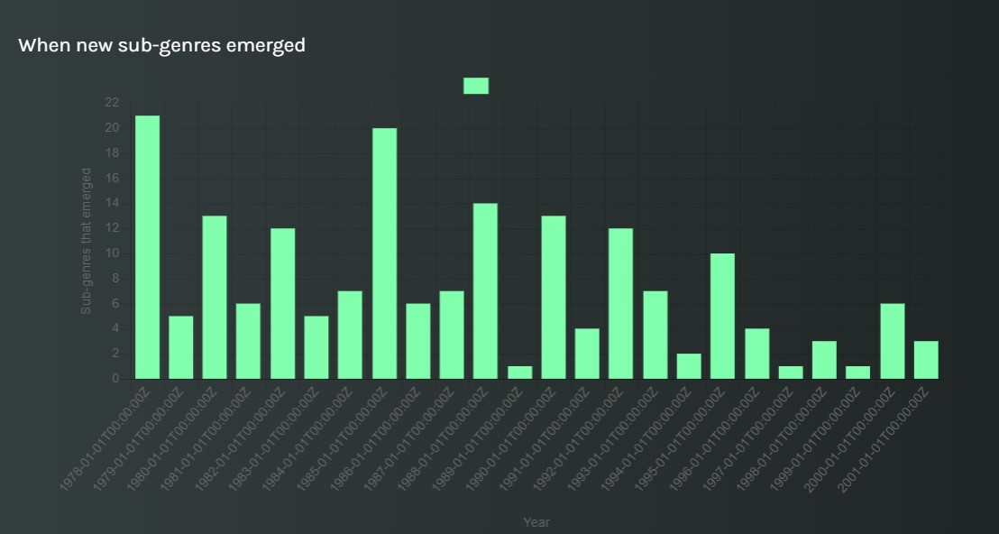

<html>
<head>
  <title>Rock Music: beyond the boundaries of space and time</title>
<meta name="viewport" content="width=device-width, initial-scale=1">

  
</head>
<body>

  <a href="https://giuliam2.github.io/6-Girls-on-a-stage-home/">Home</a>
  <a href="https://bella2402.github.io/Theatres-in-the-UK-and-Classical-Music/">Theatre</a>
  <a class="active" href="https://giuliam2.github.io/Exploring-the-rock-music-genre/">Rock Music</a>
  <a href="https://bella2402.github.io/The-History-of-the-Guitar/">Guitars</a>
  <a href="https://giuliam2.github.io/Reports/">Our Reports</a>

  

    <h1>Rock Music: beyond the boundaries of space and time</h1>
  

  <h2><em>A story written by Giulia Montesanto and Agnese Musacchio</em></h2>
  
Whether it's the driving rhythms, blazing guitar solos, and electrifying performances, rock music has the ability to evoke the most intense emotions. This genre has fascinated and inspired countless people across time and regions, transcending boundaries and capturing the hearts of fans around the world and if you’re reading this, you’re probably one of them. Today, we embark on an incredible exploration of the changing face of rock music, delving into its evolution and uncovering some hidden gems along the way.

  

    

      

Picture this: the 1950s, a time when rock music burst onto the scene and quickly took the world by storm. Soon enough it became the unrivaled king of popular music, leaving a lasting impact that would shape the future of the industry. From Led Zeppelin’s electrifying performances to Jimi Hendrix’s infectious guitar riffs, rock music was an unstoppable force of creativity and rebellion.  
But let's zoom in on the USA, the birthplace of many influential rock bands. One name that instantly comes to mind is Nirvana, undoubtedly one of the most famous bands in the history of the USA. Led by the legendary Kurt Cobain, this band became a symbol of the rock music genre. Cobain, not content with just being a mesmerizing vocalist, also wielded his guitar with finesse. And he wasn't alone. Many members of Nirvana, as well as other rock bands, showcased their incredible versatility by playing multiple roles. But who else is connected to Cobain and plays guitar, besides singing? His wife Courtney Love, singer and guitarist of American rock band Hole. What’s interesting about this band? Well, the first thing that immediately catches one's attention is undoubtedly the fact that Hole is an all-female band, something unusual in the landscape of the rock genre. Numbers speak for themselves: out of 16 bands, only one is entirely made up of women! 

    

    

      
    

  

  

    

As rock music evolved, it embarked on a fascinating journey of diversification. Sub-genres emerged, each with its own unique sound and influences, while still retaining the essence of rock. Between the 1980s and 1995, the music scene witnessed an explosion of new genres that showcased the boundless creativity and adaptability of rock music. It was a time of experimentation and innovation, where artists fearlessly blended different styles to create something entirely new. However, as we entered the 2000s, the trend started to decline, signaling a shift in the industry. But fear not, the spirit of rebelliousness and passion still remains within the hearts of many rock musicians who keep pushing the boundaries and reinventing the genre. 
Now, let's take a step outside the United States and explore the global reach of rock music. Its popularity is widespread, captivating audiences far and wide. However, the level of its influence may vary across different nations. By delving into the music scenes of specific countries, we can see how rock music has been embraced and molded by different cultures. Each nation brings its own unique flavor to the genre, resulting in a rich tapestry of sounds. Why not discover those bands through our search engine?  <a href="https://melody-data.github.io/stories/published_stories/story_1685638796.117557.html"><b>Click here</b></a> to reach our MELODY story: search yourself for the country you are interested in and discover your new favourite bands! You will also have the opportunity to find out more about the research the article is based on.  
This the ever-evolving core of rock music, and it is waiting for you to discover it! 

 
  

  

    

    
    

  

 

<footer>
  
All rights reserved to the 6girlsonstage's project.

</footer>
 
</body>
</html>
